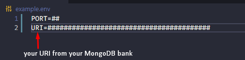
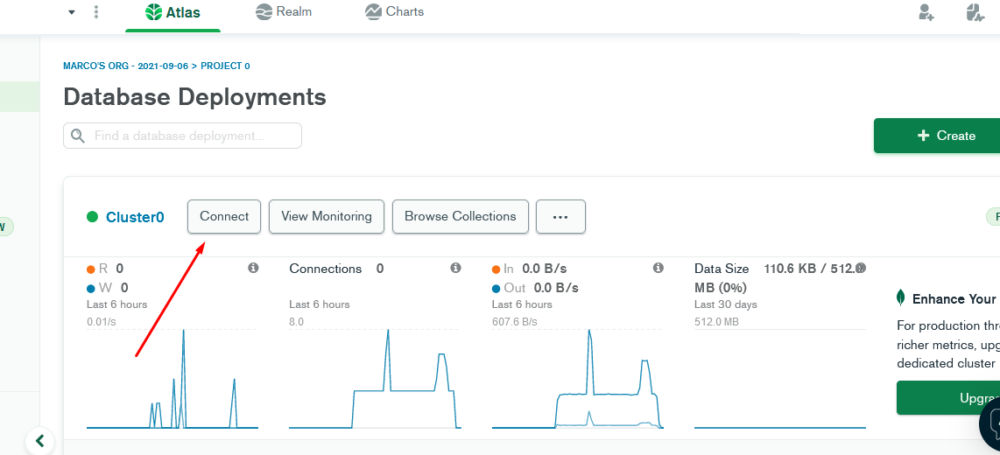

# sea-shopping-backend 🔥

> backend of the [__sea shopping frotend__]() project

- how to use? 🤔

> it is simple, after cloning the project on your machine just use the yarn or npm I command in your terminal to install the dependencies, then after that, create at the root of the project a file with the extensao.env and add the variables illustrated in the following image.

- PORT
#
 __here you will put a port on which the local server will run, for example, 80, remembering that the backend port will be the same used in the frontend part of the project to consume the data__
#

-  URI
#
__the URI is the hash that your MongoDB bank cluster generated when it was created, so first if you don't have an account in mongo create one and then create a bank__ [https://cloud.mongodb.com](https://cloud.mongodb.com)

- after creating the bank will have this appearance

to catch your click URI in the connect button where the arrow is pointing
#
after that, click on this tab, it will open a modal with your uri, after that to use it just enter your bank creation password in your uri, in the part where it is written password, between the plus and minor sign, in this way
#

✨🎉✨🎉✨🎉✨🎉✨🎉✨🎉✨🎉✨🎉✨🎉✨🎉✨🎉✨🎉✨🎉
> done all the procedures, now just from a __yarn start or npm start__ to run the project